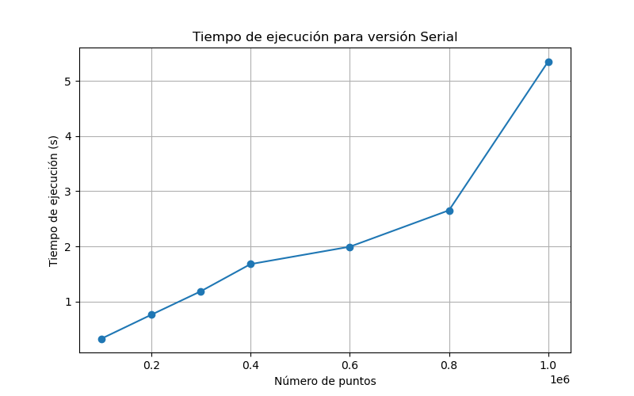
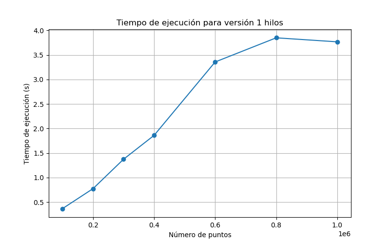
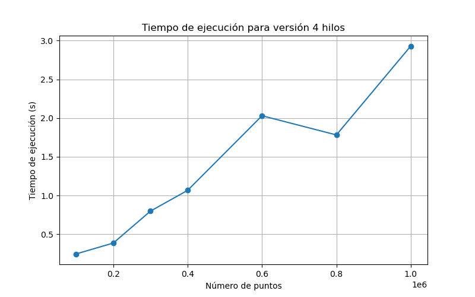
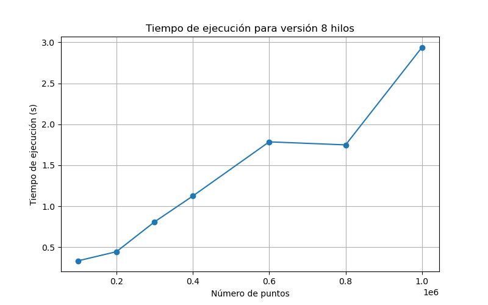
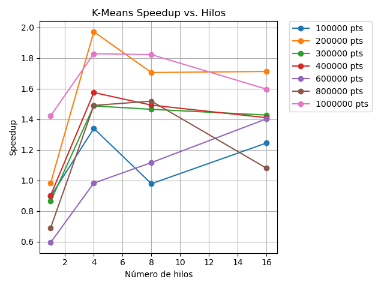
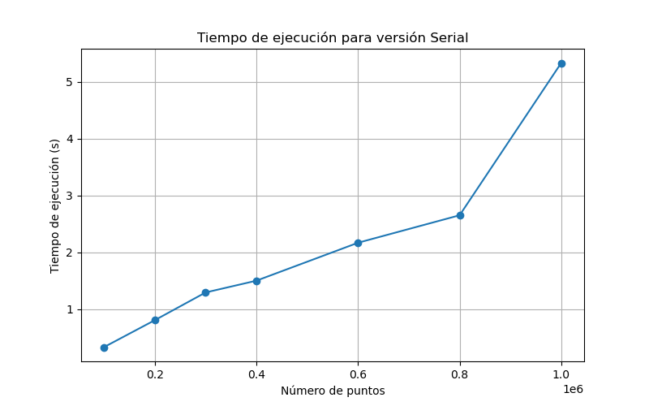
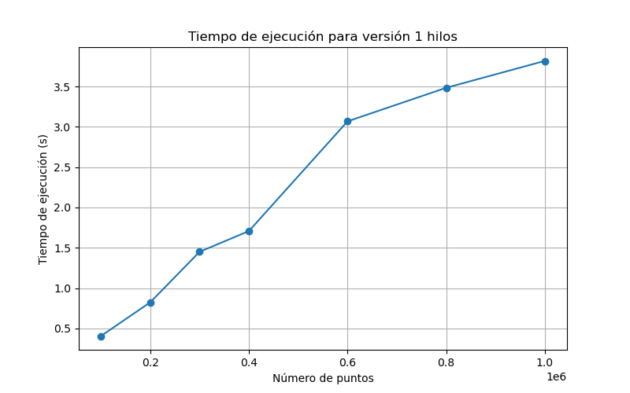
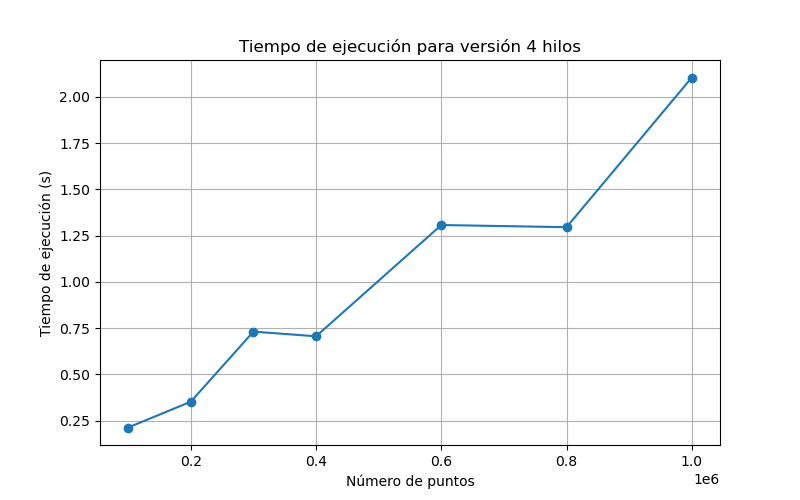
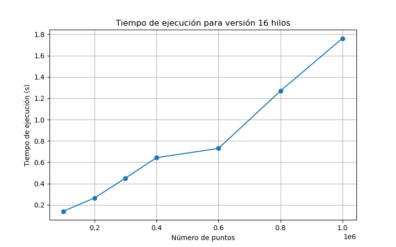
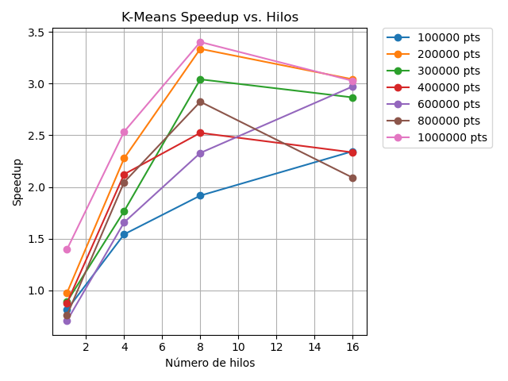

# K-Means-OMP
K-Means algorithm implemented using Open MP. First project for ITAM's course Parallel Computing

## Documentación de proyecto de apertura: comparación de implementaciones serial y paralela con K-Means

Elaborado por Guillermo Arredondo Renero. C.U. 197256
ITAM, Cómputo Paralelo bajo tutela del Profesor Octavio Gutiérrez


### Introducción 
En este proyecto se implementó un código del algortimo de K-means que recibiera un conjunto de datos en dos dimensiones a partir de un archivo de *csv*. Los datos fuente se pueden encontrar dentro de la carpeta [data](https://github.com/guillermoArr/K-Means-OMP/tree/main/data), donde cada uno de  los archivos se genera al ejecutar las primeras dos celdas del notebook [synthetic_clusters](https://github.com/guillermoArr/K-Means-OMP/blob/main/synthetic_clusters.ipynb). A partir de estos datos, las funciones desarrolladas dentro de **kmeans_parallel.cpp**, **kmeans_serial.cpp**, **kmeans_pruebas.cpp** y **kmeans_pruebas copy.cpp** generaran un nuevo archivo *csv* con los datos y la correspondiente asignación de cluster resultado del algoritmo kmeans implementado. Los resultados se almacenan dentro de la carpeta **output**, pero se omiten con .gitignore para evitar una sobre carga de archivos. 

#### Descripción de archivos:
- synthetic_clusters.ipynb: notebook aportado por el profesor Octavio para generación de datos de prueba para el algoritmo de kmeans. Se realizaron algunas modificaciones para poder mostrar los resultados tanto del algoritmo serial como del paralelo.
- kmeans_serial.cpp: implementación serial de K-means utilizada como referencia para la implementación paralela. El main provee una forma rápida de probar los resultados del algoritmo.
- kmeans_parallel.cpp: implementación paralela de K-means utilizando la librería OMP. El main provee una forma rápida de probar los resultados del algoritmo.
- kmeans_pruebas.cpp y kmeans_pruebas copy.cpp: archivo de experimento para comparación de implementaciones. Dentro del main se ejecuta el experimento descrito en la siguiente sección.
- speedups_graph.ipynb: notebook diseñado para generar las gráficas de speedup que se muestran en este reporte.

### Descripción de experimento
Para realizar la comparación entre las implementaciones serial y paralela se diseñó un experimento que permitiera obtener los tiempos de ejecución de cada implementación considerando distintos tamaños de datos y distinto número de hilos a utilizar. Además se tomó el promedio de 10 iteraciones para cada una de las combinaciones entre ambos parámetros. Dado que la idea es obtener la aceleración (*speedup*) de la implementación de K-means con OpenMP respecto a la versión serial se considera la siguiente fórmula $$\text{Speedup}_{n,p} = \frac{\text{Tiempo serial}}{\text{Tiempo en paralelo}}$$ donde *n* = Número de puntos a clusterizar y *p* = Número de hilos utilizados. El tiempo de ejecución se obtiene a través del paquete de OpenMP con la función *omp_get_wtime()*. Además, para asegurar una buena comparación los métodos son llamados directamente dentro del **main** recibiendo la dirección de memoria del conjunto de datos, así como la dirección de memoria del arreglo en el que guardará los resultados (*clusterAssignment*). De esta forma es posible generar el output de cada método con una función de escritura en archivos *csv* que no se considere en la medición del tiempo de ejecución. 


**Metodología:**
1. Carga de datos: Se lee un archivo CSV con los puntos de datos de entrada.

2. Ejecución Serial: Se ejecuta el algoritmo K-Means en modo secuencial y se mide el tiempo de ejecución promedio de 10 repeticiones.

3. Ejecución Paralela: Se ejecuta la versión paralela de K-Means para cada configuración de hilos, midiendo el tiempo de ejecución promedio en 10 repeticiones.

4. Cálculo de Speedup y generación de resultados en archivo *csv* (speedups.csv), con el siguiente formato:  
```python-repl
DataSize,NumThreads,SerialTime,ParallelTime,Speedup
100000,1,0.52,0.50,1.04
100000,4,0.52,0.20,2.60
100000,8,0.52,0.15,3.47
100000,16,0.52,0.12,4.33
...
```
    Estos resultados se utilizan después para generar gráficas en función del número de threads.

5. Liberación de memoria para arreglos dinámicos utilizados durante el experimento (*data* y *clusterAssignment*).


**Parámetros del experimento:**
1. Tamaños de datos: Se utilizan conjuntos de datos de diferentes tamaños para analizar el impacto del volumen de datos en el rendimiento. Los tamaños considerados son:
    - 100,000 puntos
    - 200,000 puntos
    - 300,000 puntos
    - 400,000 puntos
    - 600,000 puntos
    - 800,000 puntos
    - 1,000,000 puntos
2. Número de threads en la ejecución paralela: Se varía la cantidad de hilos utilizados en OpenMP para analizar cómo influye el número de núcleos en la aceleración. Se prueban cuatro configuraciones:
    - 1 hilo
    - 4 hilos (mitad de los hilos disponibles en el sistema) 
    - 8 hilos (cantidad de hílos disponibles)
    - 16 hilos (duplicando el número de hilos disponibles para evaluar el *overhead* por exceso)
3. Número de iteraciones: Cada configuración se ejecuta 10 veces y se calcula el tiempo promedio para minimizar la variabilidad de los resultados.
4. Número de clusters (*k*): hiperparámetro de la implementación de K-means (tanto serial como paralela) que debe asignarse como parámetro durante la ejecución del archivo ejecutable. Establece el número de clusters que buscará el algoritmo.
5. Número máximo de iteraciones (*maxIterations*): hiperparámetro de la implementación de K-means (tanto serial como paralela) que debe asignarse como parámetro durante la ejecución del archivo ejecutable. Establece el tope de iteraciones antes de detener el algoritmo en caso de no converger.
6. Semilla utilizada para el método *rand()* utilizando para la asignación de clusters dentro del algortimo de K-means.

Ejecución de experimento:
```sh
.\[nombre_archivo].exe <maxIterations> <k> <seed>

.\kmeans_pruebas.exe 5000 5 6
```

#### Condiciones de experimento
El experimento se ejecuta con una Laptop en la que nos aseguramos de tener enchufada a la corriente eléctrica para evitar condiciones de ahorro de energía, así como evitar tener toda tarea no esencial en ejecución al mismo tiempo. El equipo consiste de las siguientes características:

* Hardware:
    - Modelo: Laptop HP EliteBook 840 G6
    - Procesador: Intel(R) Core(TM) i7-8665U CPU @ 1.90GHz 2.11 GHz
    - RAM instalada 16.0 GB (15.8 GB utilizable)
    - Tipo de sistema: Sistema operativo de 64 bits, procesador x64
    - Núcleos: 4
    - Procesadores lógicos: 8
    - Caché: 
        - L1: 256 kB
        - L2: 1.0 MB
        - L3: 8.0 MB
* Software:
    - Sistema operativo
        - Edición Windows 11 Home Single Language
        - Versión 24H2
        - Se instaló el 09/03/2025
        - Compilación del SO: 26100.3476
        - Experiencia: Paquete de experiencia de características de Windows 1000.26100.54.0
    - Compilador
        - Se utiliza el compilador g++ para C/C++ 
        - g++.exe (Rev2, Built by MSYS2 project) 14.2.0. Copyright (C) 2024 Free Software Foundation, Inc.

### Resultados
A continuación se presentan los resultados para dos versiones de paralelización: la establecida dentro del código kmeans_pruebas.cpp (versión final 1) y la establecida dentro del código kmeans_prueba copy.cpp (versión final 2). 

La diferencia entre ambas implementaciones radica en la definición de la región crítica como se muestra a continuación:

**Versión 1:**
```C++
#pragma omp parallel for schedule(static)
for (int i = 0; i < numPoints; i++) {
    int cluster = clusterAssignment[i];
    #pragma omp atomic
    clusterSizes[cluster]++;
    
    #pragma omp critical
    {
        newCentroids[cluster][0] += data[i][0];
        newCentroids[cluster][1] += data[i][1];
    }
}
```

**Versión 2:**
```C++
#pragma omp parallel
{
    // Thread-local accumulators
    int* localSizes = new int[k]();
    double** localSums = new double*[k];
    for (int i = 0; i < k; i++) {
        localSums[i] = new double[2]{0.0, 0.0};
    }

    // Accumulate local sums
    #pragma omp for schedule(dynamic, 1000)
    for (int i = 0; i < numPoints; i++) {
        int cluster = clusterAssignment[i];
        localSizes[cluster]++;
        localSums[cluster][0] += data[i][0];
        localSums[cluster][1] += data[i][1];
    }

    // Combine results
    #pragma omp critical
    {
        for (int i = 0; i < k; i++) {
            clusterSizes[i] += localSizes[i];
            newCentroids[i][0] += localSums[i][0];
            newCentroids[i][1] += localSums[i][1];
        }
    }

    // Clean up thread-local memory
    for (int i = 0; i < k; i++) {
        delete[] localSums[i];
    }
    delete[] localSums;
    delete[] localSizes;
}
```


#### Versión 1
**Tiempo de ejecución por número de hilos**
<table>
  <tr>
    <td align="center"></td>
    <td align="center"></td>
  </tr>
  <tr>
    <td align="center"></td>
    <td align="center"></td>
  </tr>
  <tr>
    <td align="center"></td>
  </tr>
</table>

Como podemos observar en las gráficas anteriores, el comportamiento conforme aumenta el tamaño de los datos es el esperado: el tiempo de ejecución aumenta de forma casi proporcional al aumento de tamaño. Pero podemos observar distintos comportamientos. Es curioso observar los dos mínimos locales que se presentan dentro de la versión paralela para 4 y 8 hilos, así como la curvatura de máximo local que se observa para la versión paralela con un hilo. Esto último coincide con lo esperado, dado que para un número alto de puntos se esperaría que una versión paralela con un punto funcione incluso peor que la versión serial. 

**Tabla 1. Tiempo de ejecución y speedups**
| No puntos | Hilos    | Serial (s) | OpenMP (s)   | Speedup  |
|----------|-----------|------------|--------------|---------|
| 100000   | 0         | 0.3275     | 0.3275       | NA     |
| 100000   | 1         | 0.3275     | 0.3659       | 0.8951  |
| 100000   | 4         | 0.3275     | 0.2445       | 1.3395  |
| 100000   | 8         | 0.3275     | 0.3348       | 0.9782  |
| 100000   | 16        | 0.3275     | 0.2632       | 1.2443  |
| 200000   | 0         | 0.7592     | 0.7592       | NA     |
| 200000   | 1         | 0.7592     | 0.7732       | 0.9819  |
| 200000   | 4         | 0.7592     | 0.3851       | 1.9714  |
| 200000   | 8         | 0.7592     | 0.4453       | 1.7049  |
| 200000   | 16        | 0.7592     | 0.4435       | 1.7118  |
| 300000   | 0         | 1.1860     | 1.1860       | NA     |
| 300000   | 1         | 1.1860     | 1.3729       | 0.8639  |
| 300000   | 4         | 1.1860     | 0.7977       | 1.4868  |
| 300000   | 8         | 1.1860     | 0.8099       | 1.4644  |
| 300000   | 16        | 1.1860     | 0.8311       | 1.4270  |
| 400000   | 0         | 1.6783     | 1.6783       | NA     |
| 400000   | 1         | 1.6783     | 1.8597       | 0.9025  |
| 400000   | 4         | 1.6783     | 1.0663       | 1.5739  |
| 400000   | 8         | 1.6783     | 1.1250       | 1.4918  |
| 400000   | 16        | 1.6783     | 1.1906       | 1.4096  |
| 600000   | 0         | 1.9937     | 1.9937       | NA     |
| 600000   | 1         | 1.9937     | 3.3563       | 0.5940  |
| 600000   | 4         | 1.9937     | 2.0299       | 0.9822  |
| 600000   | 8         | 1.9937     | 1.7859       | 1.1164  |
| 600000   | 16        | 1.9937     | 1.4218       | 1.4022  |
| 800000   | 0         | 2.6547     | 2.6547       | NA     |
| 800000   | 1         | 2.6547     | 3.8488       | 0.6897  |
| 800000   | 4         | 2.6547     | 1.7818       | 1.4899  |
| 800000   | 8         | 2.6547     | 1.7489       | 1.5179  |
| 800000   | 16        | 2.6547     | 2.4590       | 1.0796  |
| 1000000  | 0         | 5.3563     | 5.3563       | NA     |
| 1000000  | 1         | 5.3563     | 3.7671       | 1.4219  |
| 1000000  | 4         | 5.3563     | 2.9304       | 1.8278  |
| 1000000  | 8         | 5.3563     | 2.9398       | 1.8220  |
| 1000000  | 16        | 5.3563     | 3.3556       | 1.5962  |
Nota: Resultado obtenidos con código de kmeans_pruebas.cpp



En cuanto a los *speedups* notamos comportamientos muy diversos de acuerdo al tamaño de los datos. Por un lado, vemos que el máximo speedup se obtiene para 200,000 datos y con 4 hilos. Asimismo, observamos que, a excepción de para 100,000 y 600,000 datos, se sigue un comportamiento ascendente conforme aumenta el número de hilos y una caída al exceder el número máximo de hilos disponibles (16 hilos). Este resultado también es el esperado debido al *overhead* generado por generar más hilos.

#### Versión 2
**Tiempo de ejecución por número de hilos**
<table>
  <tr>
    <td align="center"></td>
    <td align="center"></td>
  </tr>
  <tr>
    <td align="center"></td>
    <td align="center"></td>
  </tr>
  <tr>
    <td align="center"></td>
  </tr>
</table>

Para la versión 2 observamos un comportamiento muy similar al de la versión 1, por lo que nos enfocaremos en destacar las magnitudes del eje vertical. Nótese que la diferencia entre el rango de la versión serial respecto a las paralelas es mucho mayor. Entre las paralelas, el mejor resultado (de acuerdo al rango) se identifica con 8 hilos. Análogamente a la versión 1, notamos que para 16 hilos, el rango vuelve a aumentar a causa del overhead.


**Tabla 2. Tiempo de ejecución y speedups**
| No puntos | Hilos    | Serial (s) | OpenMP (s)   | Speedup |
|----------|-----------|------------|--------------|---------|
| 100000   | 0         | 0.3295     | 0.3295       | NA      |
| 100000   | 1         | 0.3295     | 0.4053       | 0.8130  |
| 100000   | 4         | 0.3295     | 0.2136       | 1.5426  |
| 100000   | 8         | 0.3295     | 0.1719       | 1.9168  |
| 100000   | 16        | 0.3295     | 0.1405       | 2.3452  |
| 200000   | 0         | 0.8039     | 0.8039       | NA      |
| 200000   | 1         | 0.8039     | 0.8234       | 0.9763  |
| 200000   | 4         | 0.8039     | 0.3530       | 2.2773  |
| 200000   | 8         | 0.8039     | 0.2410       | 3.3357  |
| 200000   | 16        | 0.8039     | 0.2643       | 3.0416  |
| 300000   | 0         | 1.2921     | 1.2921       | NA      |
| 300000   | 1         | 1.2921     | 1.4503       | 0.8909  |
| 300000   | 4         | 1.2921     | 0.7316       | 1.7661  |
| 300000   | 8         | 1.2921     | 0.4249       | 3.0409  |
| 300000   | 16        | 1.2921     | 0.4508       | 2.8662  |
| 400000   | 0         | 1.4996     | 1.4996       | NA      |
| 400000   | 1         | 1.4996     | 1.7075       | 0.8782  |
| 400000   | 4         | 1.4996     | 0.7063       | 2.1232  |
| 400000   | 8         | 1.4996     | 0.5943       | 2.5233  |
| 400000   | 16        | 1.4996     | 0.6423       | 2.3347  |
| 600000   | 0         | 2.1675     | 2.1675       | NA      |
| 600000   | 1         | 2.1675     | 3.0689       | 0.7063  |
| 600000   | 4         | 2.1675     | 1.3075       | 1.6577  |
| 600000   | 8         | 2.1675     | 0.9306       | 2.3291  |
| 600000   | 16        | 2.1675     | 0.7294       | 2.9716  |
| 800000   | 0         | 2.6518     | 2.6518       | NA      |
| 800000   | 1         | 2.6518     | 3.4852       | 0.7609  |
| 800000   | 4         | 2.6518     | 1.2959       | 2.0463  |
| 800000   | 8         | 2.6518     | 0.9389       | 2.8244  |
| 800000   | 16        | 2.6518     | 1.2685       | 2.0905  |
| 1000000  | 0         | 5.3340     | 5.3340       | NA      |
| 1000000  | 1         | 5.3340     | 3.8186       | 1.3969  |
| 1000000  | 4         | 5.3340     | 2.1045       | 2.5346  |
| 1000000  | 8         | 5.3340     | 1.5679       | 3.4020  |
| 1000000  | 16        | 5.3340     | 1.7624       | 3.0266  |
Nota: Resultado obtenidos con código de kmeans_pruebas copy.cpp



Para la versión 2, nos gustaría resaltar la diferencia de la gráfica de *speedups* respecto a la versión 1. Ya que el comportamiento de los *speedups* de la versión 2 es mucho más consistente que los obtenidos en la versión 1. En este caso cabe destacar el comportamiento curvo para varios tamaños de datos lo que coincide con lo esperado por teoría: el *speedup* aumenta conforme aumentan los hilos pero hasta cierto punto, ya que al sobre pasar el número máximo se obtiene una caída en los valores del *speedup*. Por último, cabe destacar que el nuevo *speedup* máximo es para 1,000,000 de datos y con 8 hilos. 

### Discusión
La diferencia en los resultados puede explicarse debido al cuello de botella que se genera a partir de una región crítica dentro de un for paralelizado, lo que genera una pérdida de la eficiencia por esperar a la realización de las instrucciones dentro de esas regiones. En cambio, en la versión 2 utilizamos variables locales para obtener y guardar las sumas que después podemos utilizar para realizar las actualizaciones dentro de la región crítica. Asimismo, puede observarse que en la versión final del código se encuentran comentadas dos instrucciones de ```#pragma omp parallel for``` esto se debe a que asumiendo una *k* pequeña (como habitualmente lo es), los ciclo no son computacionalmente intensos, por lo que resulta más eficiente realizarlos secuencialmente. 

## Anexo 1
#### Código del experimento

``` C++
int main(int argc, char** argv) {
    if (argc < 4) {
        std::cerr << "Usage: " << argv[0] << " <max_iterations> <num_clusters> <seed>\n";
        return 1;
    }
    
    // Create/Overwrite the CSV file and write headers
    ofstream out("output/speedups.csv");
    if (!out.is_open()) {
        cerr << "Error: Could not create speedup_results.csv\n";
        return 1;
    }
    out << "DataSize,NumThreads,SerialTime,ParallelTime,Speedup\n"; // Column headers
    out.close();

    // Experiment design
    int max_threads = omp_get_max_threads();
    int num_threads[4] = {1, max_threads/2, max_threads, max_threads*2};
    int num_points[7] = {100000, 200000, 300000, 400000, 600000, 800000, 1000000};
    double start, serial_time, parallel_time;

    // Converting the first command-line argument (argv[1]) into an integer for maximum number of iterations
    const int max_iterations = atoi(argv[1]);

    // Converting the second command-line argument (argv[2]) into an integer that represents the number of clusters (num_clusters) to be used in the K-means algorithm
    const int num_clusters = atoi(argv[2]);

    // User provided seed 
    const int seed = atoi(argv[3]);  

    // Set the seed for reproducibility
    srand(seed);
    
    for (int data_size : num_points){
        string input = "data/" + to_string(data_size) + "_data.csv";
        char const *input_file_name = input.c_str();

        // Parameters for each K-means function
        double** data = new double*[data_size];
        int* clusterAssignment = new int[data_size];

        for (long long int i = 0; i < data_size; i++) {
            data[i] = new double[3]{0.0, 0.0, -1};  // Memory allocation for 2D points and cluster assignments
        }

        load_CSV(input_file_name, data, data_size);

        // SERIAL execution
        cout << "Ejecutando kmeans serial para " << input_file_name << " de tamanio " << data_size << " buscando " << num_clusters << " clusters\n";
        string output_serial = "output/" + to_string(data_size) + "_results_serial_";

        // Run the serial experiment 10 times and calculate the average time
        double total_serial_time = 0.0;
        for (int i = 0; i < 10; i++) {
            start = omp_get_wtime();
            
            // Execute the K-means Serial Algorithm
            kmeans_serial(data, data_size, num_clusters, max_iterations, clusterAssignment);
            
            // Measure Execution Time for Serial
            total_serial_time += omp_get_wtime() - start;
            
            // Write results to csv
            save_to_CSV(output_serial + to_string(i) + ".csv", data, data_size, clusterAssignment);
            
        }
        serial_time = total_serial_time / 10.0;

        // Report Execution Time for Serial
        cout << "Tiempo de ejecucion promedio en serial: " << serial_time << " segundos.\n";

        string output_parallel = "output/" + to_string(data_size) + "_results_parallel_";

        for (int threads : num_threads) {
            omp_set_num_threads(threads);
            cout << "\nRunning with " << threads << " threads:" << endl;

            // Parallel execution with the same data
            double total_parallel_time = 0.0;
            for (int i = 0; i < 10; i++) {
                start = omp_get_wtime();

                // Execute the K-means Parallel Algorithm
                kmeans_paralelo(data, data_size, num_clusters, max_iterations, clusterAssignment);

                total_parallel_time += (omp_get_wtime() - start);

                // Write results to csv
                save_to_CSV(output_parallel + to_string(i) + ".csv", data, data_size, clusterAssignment);
            }

            parallel_time = total_parallel_time / 10.0;
            
            cout << "Tiempo de ejecucion promedio paralelo con " << threads << " threads: " << parallel_time << " segundos" << endl;
            cout << "Speedup: " << serial_time / parallel_time << "x\n";

            // Save speedup results to CSV
            save_speedup_results(data_size, threads, serial_time, parallel_time);
        }

        // Clean up dynamically allocated memory
        for (long long int i = 0; i < data_size; i++) {
            delete[] data[i];
        }
        delete[] data;
        delete[] clusterAssignment;
    }

    // Program exit
    return 0;
}
```
